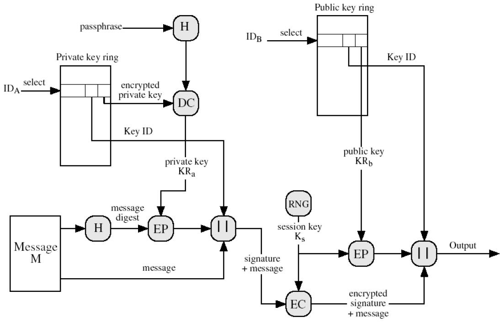

# 安全协议基础
## Internet协议及其安全需求
- 信息安全目标
  - 保密性
  - 完整性
  - 可用性
- 计算机网络面临的安全威胁
  - 截获（被动）
  - 中断（主动）
  - 篡改（主动）
  - 伪造（主动）
- 网络安全需求
  - 机密性
  - 完整性
  - 可用性
  - 不可否认性
  - 身份认证（鉴别）
  - 访问控制
- 计算机网络通信安全的目标
  - 防止析出报文内容
  - 防止通信量分析
  - 检测更改报文流
  - 检测拒绝报文服务
  - 检测伪造初始化连接

## 密码学回顾
- 数字签名
  - 步骤
    - Signature = KRa(Hash(M))
    - a -> (M||Signature) -> b
    - b check if KUa(Signature) == Hash(M)
  - 安全性
    - 完整性，由Hash提供
    - 身份认证（鉴别），由发送方私钥加密（或加盐）提供
    - 不可否认性，由发送方私钥加密（或加盐）提供
  - Hash分类
    - 弱无碰撞：几乎找不到x'使得h(x)=h(x')
    - 强无碰撞：几乎不可能找到x'使得h(x)=h(x')
    - MAC：Message Authentication Code 需要密钥
    - MDC：Message Detection Code 不用密钥
- 数字信封
  - 步骤
    - Digital Envelope = KUb(Ks)
    - a -> (Ks(M)||KUb(Ks)) -> b
    - b: KRb(KUb(Ks)) -> Ks -> M
  - 安全性
    - 机密性
- 密钥管理与分配
  - 基于对称密码体制的对称密钥分配
    - A -> A, B -> KDC
    - KDC -> Ka(Kab, Kb(A, B, Kab)) -> A
    - A -> Kb(A, B, Kab) -> B
  - 基于公钥密码体制的对称密钥分配（前三步为鉴别）
    - A -> KUb(IDa, N1) -> B
    - B -> KUa(N1, N2) -> A
    - A -> KUb(N2) -> B
    - A -> KUb(KRa(Ks)) -> B
  - 基于公钥密码体制的公钥分配
    - 公开发布：用户将公钥直接发给其他用户；容易假冒，以其他用户名义发布公钥
    - 公用目录表：由可信实体建立、接受用户注册公钥、维护，内容为用户名+公钥；目录表易受攻击
    - 公钥授权：在公用目录表基础上更严格，用户要可靠知道管理员公钥。公钥管理机构成为系统瓶颈（效率、安全性）
      - a -> Req||Time1 -> Authority
      - Authority -> KRauth(KUb||Req||Time1) -> a
      - a -> KUb(IDa||N1) -> b
      - b -> Req||Time2 -> Authority
      - Authority -> KRauth(KUa||Req||Time2) -> b
      - b -> KUa(N1||N2) -> a
      - a -> KUb(N2) -> b
    - 公钥证书(通信双方交换证书即可，不需要与管理机构联系，解决瓶颈问题)
      - Ca=KRauth(T,IDa,KUa) 时间戳、用户身份标识、用户公钥
      - a -> KUa -> CA
      - CA -> ERauth(T1, IDa, KUa) (Ca) -> a
      - b -> KUb -> CA
      - CA -> ERauth(T2, KDb, KUb) (Cb) -> b
      - a -> Ca -> b
      - b -> Cb -> a
  - PKI（公钥基础设施）组件
    - RA(Registration Authority)：将用户身份与密钥绑定
    - CA(Certificate Authority)：发证、验证、撤销、更新
    - 证书库：保存证书、证书撤销列表(CRL)
    - 流程
      - a -> Certificate Request(KUa) -> RA
      - RA verifies Certificate request and send to CA
      - CA creates certificate using KRca, store certificate in CA database
      - CA return certificate to a

# 安全协议概述
## 安全协议概念
- 协议：两个或以上参与者采取一系列步骤以完成某项特定任务
  - 至少两个参与者
  - 参与者之间消息处理和消息替换交替进行
  - 通过执行协议必须完成某项任务、或达成某种共识
- 安全协议：建立在密码体制基础上的一种高互通协议，运行在计算机网络或分布式系统中，为安全需求各方面提供一系列步骤，借助密码算法达到密钥分配、身份认证、信息保密等目的。
## 安全协议的安全属性及实现
- 认证性：共享秘密实现（对称or非对称密钥、盐、可信第三方）
- 机密性：对明文加密
- 完整性: 通过Hash(MAC or MDC)生成ICV(完整性校验值)
- 不可否认性: 对方参与协议交换的证据，如签名

## 协议设计准则
- 消息独立完整：消息的含义完全由消息本身决定，不必借助上下文推断。
  - a -> m -> b, m应该包含A,B的标识
- 消息前提准确：与消息相关前提条件应明确指出且其正确性能得到验证
- 主体身份标识：消息带有消息所属主体的身份
- 加密
- 签名：应先签名后加密
- 随机数：给消息提供新鲜性。挑战-应答:消息需包含挑战值的Hash
- 时戳：提供新鲜性，依赖于时钟同步
- 编码：明确指出编码格式

## 安全协议缺陷分类
- 基本协议缺陷：先加密后签名存在漏洞，签名可被解开并替换
- 陈旧消息：消息无新鲜性、存在重放攻击，解决对策:
  - 序列号
  - 时戳
  - 挑战-应答（随机数）
  - 随机数nonce和时戳的区别：光使用nonce可能产生相同的随机数，正常请求也会被当作攻击，所以引入时戳，即使随机数相同，只要是不同时间产生的，都被认为是合法的随机数。
- 并行会话：通过对正常协议会话中的消息构造或重放，形成另一个会话

## 常见协议及其攻击
### 私钥协议
- RPC协议：无身份标识，可假冒，多重会话攻击
- NS私钥协议（第三方存在的对称密钥协商）：无新鲜性，可重放。如何修订？
- Otway-Rees协议：类型缺陷，协议中存在不同的消息格式一致，
- 大嘴青蛙协议：重放
- Yahalom协议：类型缺陷
### 公钥协议
- Diffie-Hellman
  - G N为AB共识
  - A -> G^x mod N -> B
  - B -> G^y mod N -> A
  - 双方：k = G^x^y mod N
- station-to-station：身份标识是明文
- NS公钥协议：无身份标识，假冒
- Denning Sacco协议：无身份标识，可假冒。Z通过正常协议得到Certa, Certz, KUz(KRa(Kaz, T)),解开得到Kaz, KRa(Kaz, T),截获B证书，得到KUb(KRa(Kaz, T)),即可冒充A发送消息三，且Kaz被Z已知。
  - A -> A,B -> S
  - S -> Certa, Certb -> A
  - A -> Certa, Certb, KUb(KRa(Kab, T)) -> B

# IPSec
## 概念
IP Security：支撑IP层安全的一套协议，提供了认证性和机密性，认证包的发起者，同时防止ip包传输过程中被拦截和篡改。 
IPSec三种机制：认证、信息机密性、密钥管理。

## 内容
### 两个通信保护协议（含传输、隧道两种模式）
- AH(Authentication Header)：包含一个带密钥的对整个数据包计算的Hash，提供了数据源认证、完整性、防重放（序列号），不提供机密性。
  - AH传输模式：[IP头 + AH + IP数据]，AH验证整个IP包，包括IP头中的地址，故不能穿越NAT（改变了IP头的源ip地址）
  - AH隧道模式：[新IP头 + AH + 原IP头 + IP数据]，AH验证整个IP包，包括新旧IP头，不能穿越NAT
  - 输入输出处理流程
    - 输出：SA查询（SPD数据库）->生成序列号->计算ICV（带密钥的Hash）->长度padding->分段
    - 输入：重组->SA查询->序列号验证->ICV验证
- ESP(Encapsulating Security Payload)封装安全载荷：加密+完整性校验，提供数据源认证、完整性、机密性、放重放。格式：[ESP头+IP数据+ESP尾+ESP认证]，ESP尾为长度填充，加密部分为[IP数据+ESP尾]，认证部分为[ESP头+IP数据+ESP尾]。
  - ESP传输模式：[IP头 + ESP头 + IP数据 + ESP尾 + ESP认证]，只对IP数据加密和认证，可以穿越NAT
  - ESP隧道模式：[新IP头 + ESP头 + 旧IP头 + IP数据 + ESP尾 + ESP认证]，只对旧IP头和IP数据加密和认证，可以穿越NAT
  - 输入输出处理流程
    - 输出：SA查询->生成序列号->加密->ICV->Padding->分段
    - 输入：重组->SA查询->序列号认证->ICV验证->解密
### 两个数据库
- SAD(安全关联数据库)
  - SA定义了两实体间单向的协议参数，一个IPSec连接至少要2个SA
  - 某实体维护自己的SAD，包含所有活跃的SA(与多个目标通信)，会有一个SPD数据项为指向某个SAD数据项的指针，即由SPD决定一个数据包使用哪个SA（流入流出数据均有SPD决定使用哪个SA）
- SPD(安全策略数据库)
  - 提供安全策略配置，包含源/目的地址、掩码、端口、动作。指定数据流向（丢弃、绕过IPSec，经过IPSec（指定用哪个SA））
### IKE 密钥交换管理协议：
- UDP之上的应用层协议，IPSec的信令协议，为其提供自动协商交换密钥、建立SA的服务。
- 安全机制
  - 前向安全性：长期使用的主密钥泄漏不会导致过去的会话密钥泄露
  - 数据验证
  - DH算法交换共享密钥
- 协商过程
  - 阶段一：建立IKE SA，为协商IPSec SA提供保护
    - 主模式：六个包
      - 发起方发送一个或多个IKE安全提议（包括加密、认证算法、DH组等参数），响应方查找最先匹配的IKE安全提议，并将这个IKE安全提议回应给发起方
      - DH算法交换密钥K和nonce值
      - 双方的 身份+主模式交换内容的认证（使用预共享密钥认证（需要知道彼此IP）、使用密钥K加密发送信息）
    - 野蛮模式：三个包
      - 发起方发送IKE安全提议、DH信息、身份
      - 接收方发送确认的提议、DH信息、身份和认证Hash
      - 发送方发认证Hash
    - 比较：野蛮模式比主模式效率高，但ID信息明文发送，即野蛮模式对身份没有保护。主模式只能基于IP确定预共享密钥（因为第五步才交换Name），野蛮模式能基于IP或Name。对预共享密钥认证：主模式不支持NAT转换，而野蛮模式支持。而对于证书方式认证：两种模式都能支持。
  - 阶段二：在IKE SA保护下完成IPSec协商
    - 发送IPSec安全提议、身份、验证Hash
    - 接收方匹配提议，生成密钥，发送确认的安全提议、身份、验证
    - 发送方确认提议，生成密钥，发送确认信息

# SSL(Secure Socket Layer)
## 安全性
- 机密性：非对称体系协商得到的对称密钥对数据加密
- 身份验证：基于证书进行双方身份验证（Client身份验证可选）
- 完整性：MAC校验
- 防重放：握手过程有随机数，记录过程有序列号
## 内容
- 一个SSL会话可包含多个SSL连接（点对点），会话定义的安全参数供多个连接共享
### 上层协议
- SSL握手协议(SSL handshake protocol)：协商加密套件，包含四个阶段
  - 1：建立安全能力
    - c -> client_hello -> s：支持的协议版本、加密、压缩方法、随机数
    - s -> server_hello -> c：确认协议版本、加密、压缩方法、随机数
  - 2：服务器鉴别和密钥交换
    - s -> certificate -> c
    - s -> server_key_exchange -> c：包含消息签名
    - s -> certificate_request -> c
    - s -> server_hello_done -> c
  - 3：客户机鉴别和密钥交换
    - c -> certificate -> s
    - c -> server_key_exchange -> s
    - c -> certificate_verify -> s：包含对所有握手消息的MAC的签名
  - 4：完成
    - c -> change_cipher_spec -> s：告知对方已经切换为协商好的加密套件
    - c -> finished -> s：使用加密套件发送finished，对通道验证
    - s -> change_cipher_spec -> c
    - s -> finished -> c
- SSL password变化协议(SSL change cipher spec protocol)：重新协商加密套件
- SSL警告协议(SSL alert protocol)
  - 致命消息：中止连接，废除会话ID，防止该会话建立新连接
  - 警告消息
### 下层协议
- SSL记录协议(SSL record protocol)
  - 分段、压缩、加入对数据、密钥、序列号的MAC值（完整性）、加密（机密性)、加入SSL头（加密和MAC的密钥不同）

## 脆弱性
- 客户端假冒：默认客户端不用发证书
- 不提供基于UDP应用的保护：握手之前要建立TCP连接
- 不能对抗通信流量分析：只对应用数据保护，IP头（ip地址），TCP头（端口号）仍然暴露。
- 进程中主密钥泄露：攻击者读取SSL进程的内存空间得到主密钥

# PGP(Pretty Good Privacy)
## 电子邮件安全问题
- 匿名转发
- 电子邮件欺骗(Sender Spoofing): SPF/DKIM/DMARC support authentication.
- 邮件炸弹：发送大量垃圾邮件占用邮件服务器空间
- 邮件病毒：附件为病毒程序
## PGP协议内容
- 数字签名（完整性、认证性、不可否认） + 压缩（节省空间） + 数字信封（机密性、加密效率）
- PGP流程图，接收方对称

- 公钥环：保存其他用户公钥
- 私钥环：保存自己的公私钥对
- 信任网：PGP无认证机构，相互对对方公钥签名形成证书存入公钥环（建立个人之间的信任关系）

## 脆弱性
- PGP无政府结构，A被贿赂给C的公钥签名形成证书，但C公钥虚假。所有信任A的用户都会信任C的证书。需要计算公钥、证书信任度。

